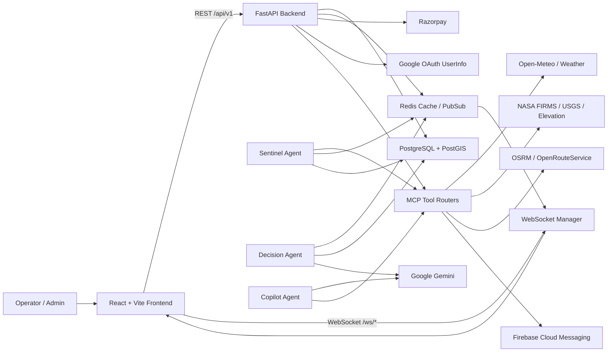
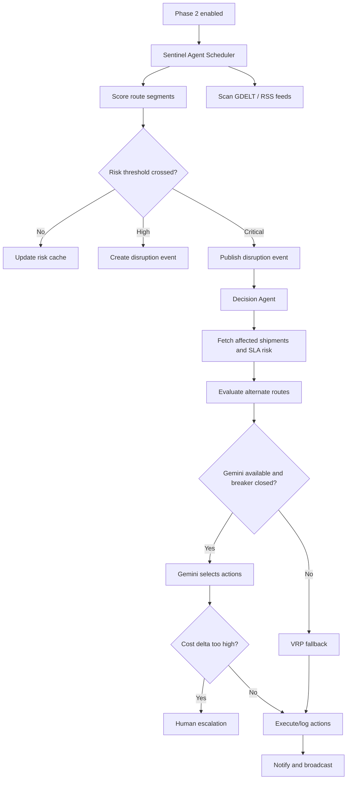

# LogistiQ AI

LogistiQ AI is a multi-tenant logistics intelligence platform for shipment visibility, geospatial disruption monitoring, autonomous risk scoring, route optimization, AI-assisted operations, and SaaS billing. The product combines a FastAPI backend, PostgreSQL/PostGIS, Redis pub/sub, Google Gemini-powered agents, MCP-style tool servers, and a React/Vite operator console.

This README reflects the current repository as audited from source files, configuration, tests, Docker assets, and CI workflows. It intentionally does not include private keys, API tokens, passwords, or production secret values.

## Table Of Contents

- [Product Summary](#product-summary)
- [Current Implementation Snapshot](#current-implementation-snapshot)
- [Core Capabilities](#core-capabilities)
- [Architecture](#architecture)
- [Technology Stack](#technology-stack)
- [Repository Structure](#repository-structure)
- [Backend Deep Dive](#backend-deep-dive)
- [Frontend Deep Dive](#frontend-deep-dive)
- [Data Model](#data-model)
- [Environment Variables](#environment-variables)
- [Public Repo Setup Guide](#public-repo-setup-guide)
- [Local Development](#local-development)
- [Docker Workflows](#docker-workflows)
- [Testing And Quality](#testing-and-quality)
- [Deployment](#deployment)
- [Security And Compliance Notes](#security-and-compliance-notes)
- [Known Implementation Notes](#known-implementation-notes)
- [Safe Git Commands](#safe-git-commands)

## Product Summary

Modern logistics teams often operate with fragmented shipment data, delayed disruption visibility, manual rerouting, weak SLA forecasting, and limited tenant-level operational controls. LogistiQ AI is built as an operations control tower that helps teams:

- Track shipments and carrier movement in real time.
- Detect flood, fire, earthquake, strike, weather, and congestion risk.
- Score route and shipment risk using external signals and cached intelligence.
- Simulate logistics disruption scenarios for demos and operational drills.
- Receive AI-assisted route and risk recommendations.
- Manage tenants, users, roles, subscriptions, and usage.
- Stream dashboard, disruption, shipment, carrier-auction, VRP, and Copilot events over WebSockets.

The application is designed around India-first logistics and emerging-market resilience, while still supporting generic multimodal shipment concepts such as road, rail, sea, air, and multimodal freight.

## Current Implementation Snapshot

| Area | Current State |
| --- | --- |
| Monorepo | `backend`, `frontend`, `infra`, `docs`, `.github`, and local scripts |
| Backend | FastAPI app with async SQLAlchemy, Redis, Prometheus metrics, JWT auth, role checks, WebSockets, MCP routers, agents, billing, tests |
| Frontend | React 19 + Vite + TypeScript dashboard application with auth, map, tracking, routing, analytics, billing, reports, settings, and Copilot pages |
| Database | PostgreSQL 16 + PostGIS intended for production; SQLite-compatible fallbacks exist for tests |
| Cache/pubsub | Redis for WebSocket fanout, usage counters, rate limiting, risk cache, and agent channels |
| AI | Google Gemini configuration, Copilot flow, decision agent graph, Sentinel risk scanner, GDELT scanner |
| Billing | Razorpay subscription workflow in backend and frontend demo/checkout integration |
| CI/CD | GitHub Actions quality/deploy workflow and GCP Cloud Build configuration |
| Tests | 129 backend tests currently discoverable: 61 unit tests and 68 integration tests |

## Core Capabilities

### Authentication And Tenancy

- Email/password registration creates a tenant and an admin user.
- Login returns JWT access and refresh tokens.
- Google OAuth sign-in is supported by exchanging a Google access token with the backend.
- Tenant context is extracted from JWTs and placed on request state.
- Role-based access control is available for admin, manager, operator, and viewer roles.
- Tenant-aware database sessions set `app.tenant_id` for PostgreSQL row-level-security style isolation.

### Shipment Operations

- Create, list, retrieve, update, and cancel shipments.
- Filter shipments by status.
- Track origin, destination, current coordinates, mode, sector, carrier, SLA deadline, ETA, weight, temperature, risk score, and CO2 fields.
- Manage carriers with supported modes, rating, cost per km, CO2 per tonne-km, and availability.
- Export frontend shipment table data as CSV.
- Receive fleet-wide and per-shipment WebSocket updates.

### Disruption Management

- List, create, retrieve, and resolve disruptions.
- Filter disruptions by type, severity, and status.
- Supported disruption categories include flood, fire, quake, strike, port congestion, fuel shortage, tariff, cyber, cold-chain breach, JIT failure, weather, traffic, accident, natural disaster, and security.
- Disruption records support geospatial center points, radius, risk score, source APIs, affected segments, impact, status, and auto-handled state.
- Affected-shipment checks are designed for PostGIS spatial matching, with graceful test fallbacks when SQLite is used.

### AI And Agent Workflows

- Sentinel Agent scores route segments and scans news feeds when `PHASE_2_ENABLED=true`.
- GDELT scanner ingests GDELT and RSS-style news feeds, classifies logistics disruption signals, extracts locations, and writes risk signals to Redis.
- Decision Agent uses a LangGraph-style flow with Gemini selection, VRP fallback, human escalation, action logging, and notification hooks.
- Copilot Agent classifies operator questions into shipment status, risk query, route suggestion, analytics, and general intents.
- Copilot can fall back to template and database/tool responses when Gemini is not configured.

### Route Optimization

- OR-Tools powers VRP and CVRP-style optimization.
- Route cost can combine distance, mode cost, risk penalty, and carbon penalty.
- High-risk edges can be blocked.
- Fallback nearest-neighbour logic exists if OR-Tools cannot solve a route.
- MCP routing tools expose route, alternatives, ETA, route-risk, and multimodal options.

### Real-Time Experience

- WebSocket authentication uses `?token=<jwt>` because browser WebSocket APIs cannot set custom headers.
- Fleet tracking, per-shipment tracking, disruption feeds, dashboard ticks, agent logs, VRP results, carrier auction updates, and Copilot sessions are streamed through dedicated channels.
- Frontend sockets automatically normalize `/ws` paths, detect expired JWTs, send heartbeat pings, and reconnect with backoff.

### Billing And Usage

- Razorpay customer, subscription, cancellation, plan change, and webhook verification flows exist in the backend.
- Billing endpoints are admin-protected except webhook handling.
- Webhooks are HMAC-SHA256 verified with the configured Razorpay webhook secret.
- Usage counters are Redis-backed and tested.
- Frontend shows Starter, Pro, and Enterprise plans with Razorpay checkout/demo support.

### Observability And Operations

- FastAPI exposes `/health` for liveness/readiness-style checks.
- Prometheus metrics are exposed at `/metrics`.
- Structured logging uses `structlog`.
- Request middleware adds request and trace IDs to logs and response headers.
- CI runs lint, format checks, type checks, unit tests, integration tests, coverage, and scheduled benchmarks.

## Architecture



The backend is the source of truth for authentication, tenant isolation, domain models, agent scheduling, and external-service orchestration. The frontend is a Vite SPA that consumes REST endpoints through Axios/TanStack Query and real-time updates through WebSockets.

## Technology Stack

| Layer | Technologies |
| --- | --- |
| Frontend runtime | React 19, Vite 8, TypeScript 6 |
| Frontend state/data | TanStack Query, Zustand, Axios |
| Frontend UI | Tailwind CSS 4, Radix UI/shadcn-style components, lucide-react, Sonner, Recharts |
| Maps/geospatial UI | MapLibre, react-map-gl, deck.gl |
| Auth UI | Google OAuth provider, custom Google sign-in button |
| Backend API | FastAPI, Uvicorn, Pydantic v2, Pydantic Settings |
| Backend persistence | SQLAlchemy 2 async, asyncpg, Alembic, GeoAlchemy2 |
| Database/cache | PostgreSQL 16 + PostGIS 3.4, Redis 7 |
| AI/ML | Google Gemini, LangGraph, LangChain Google GenAI, OR-Tools, spaCy, NumPy |
| Background jobs | APScheduler, Redis pub/sub |
| Billing | Razorpay Python SDK, Razorpay Checkout |
| Observability | structlog, Prometheus FastAPI Instrumentator |
| Testing | pytest, pytest-asyncio, httpx, fakeredis, aiosqlite, coverage |
| Quality | Ruff, mypy, pre-commit |
| Infrastructure | Docker, Docker Compose, Cloud Run, Artifact Registry, Firebase Hosting, Cloud Build, GitHub Actions |

## Repository Structure

```text
logistiq-ai/
├── backend/
│   ├── main.py                    # FastAPI app, lifespan, middleware, metrics, routers
│   ├── core/                      # settings, auth, middleware, logging, schemas, exceptions
│   ├── db/                        # async database setup, models, seed data, Alembic migrations
│   ├── api/                       # REST and WebSocket routers
│   ├── agents/                    # Sentinel, Decision, Copilot, GDELT scanner
│   ├── mcp_servers/               # weather, satellite, routing, shipment, notification tools
│   ├── ml/                        # risk scoring and VRP solver
│   ├── billing/                   # Razorpay client and Redis usage tracking
│   ├── tests/                     # unit and integration tests
│   ├── pyproject.toml             # backend dependencies and tool config
│   └── uv.lock                    # locked Python dependency graph
├── frontend/
│   ├── src/
│   │   ├── components/            # auth, layout, billing, map, UI components
│   │   ├── hooks/                 # server warmup and WebSocket hooks
│   │   ├── lib/                   # API client, utilities, city data
│   │   ├── pages/                 # route-level page wrappers
│   │   ├── stores/                # Zustand stores
│   │   ├── types/                 # TypeScript domain types
│   │   └── views/                 # dashboard, tracking, routes, analytics, billing, Copilot
│   ├── package.json
│   ├── pnpm-lock.yaml
│   └── vite.config.ts
├── infra/
│   ├── Dockerfile.backend
│   ├── Dockerfile.frontend
│   ├── docker-compose.yml         # full local stack
│   └── cloudbuild.yaml            # GCP build/deploy pipeline
├── docs/
│   ├── AI_CONTEXT.md
│   └── swagger.json
├── .github/workflows/ci.yml
├── docker-compose.yml             # local PostGIS, Redis, Redis Commander
└── README.md
```

## Backend Deep Dive

### Application Lifecycle

`backend/main.py` creates the FastAPI app, configures logging, checks database and Redis connectivity, conditionally starts Phase 2 agents, exposes Prometheus metrics, registers exception handlers, mounts routers, and exposes `/health`.

Important runtime behavior:

- Swagger UI, ReDoc, and OpenAPI JSON are disabled when `ENVIRONMENT=production`.
- `TenantMiddleware` runs for every HTTP request.
- CORS origins come from `ALLOWED_ORIGINS`.
- Sentinel and Decision agents only start when `TESTING=false` and `PHASE_2_ENABLED=true`.
- `/health` returns process status, environment, timestamp, database status, Redis status, and Phase 2 state.
- `/metrics` is exposed for Prometheus scraping.

### Active REST API Surface

All active REST endpoints are mounted with the `/api/v1` prefix.

| Domain | Method | Path | Purpose |
| --- | --- | --- | --- |
| Auth | `POST` | `/api/v1/auth/register` | Create tenant and admin user, return tokens |
| Auth | `POST` | `/api/v1/auth/login` | Authenticate email/password |
| Auth | `POST` | `/api/v1/auth/google` | Exchange Google OAuth access token for LogistiQ JWT |
| Auth | `POST` | `/api/v1/auth/refresh` | Refresh access token |
| Auth | `POST` | `/api/v1/auth/logout` | Blacklist refresh token |
| Auth | `GET` | `/api/v1/auth/me` | Current user profile |
| Shipments | `GET` | `/api/v1/shipments` | List tenant shipments with filters/pagination |
| Shipments | `POST` | `/api/v1/shipments` | Create shipment |
| Shipments | `GET` | `/api/v1/shipments/{shipment_id}` | Fetch shipment |
| Shipments | `PATCH` | `/api/v1/shipments/{shipment_id}` | Update shipment fields/status |
| Shipments | `DELETE` | `/api/v1/shipments/{shipment_id}` | Soft-cancel shipment |
| Carriers | `GET` | `/api/v1/carriers` | List carriers |
| Carriers | `POST` | `/api/v1/carriers` | Create carrier |
| Carriers | `GET` | `/api/v1/carriers/{carrier_id}` | Fetch carrier |
| Disruptions | `GET` | `/api/v1/disruptions` | List disruptions |
| Disruptions | `POST` | `/api/v1/disruptions` | Report disruption |
| Disruptions | `GET` | `/api/v1/disruptions/affected` | Find affected shipments |
| Disruptions | `GET` | `/api/v1/disruptions/{disruption_id}` | Fetch disruption |
| Disruptions | `PATCH` | `/api/v1/disruptions/{disruption_id}/resolve` | Resolve disruption |
| Analytics | `GET` | `/api/v1/analytics/summary` | KPI summary |
| Analytics | `GET` | `/api/v1/analytics/shipments/by-status` | Status breakdown |
| Analytics | `GET` | `/api/v1/analytics/shipments/by-mode` | Mode breakdown |
| Analytics | `GET` | `/api/v1/analytics/disruptions/trend` | Disruption trend |
| Analytics | `GET` | `/api/v1/analytics/risk/heatmap` | Risk heatmap payload |
| Analytics | `GET` | `/api/v1/analytics/usage` | Usage counters |
| Billing | `GET` | `/api/v1/billing/status` | Current tenant billing status |
| Billing | `POST` | `/api/v1/billing/subscribe` | Start Razorpay subscription |
| Billing | `POST` | `/api/v1/billing/cancel` | Cancel subscription at cycle end |
| Billing | `POST` | `/api/v1/billing/change-plan` | Change plan tier |
| Billing | `POST` | `/api/v1/billing/webhook` | Razorpay webhook receiver |
| Simulation | `POST` | `/api/v1/simulation/demo` | Start demo shipment simulation |
| Simulation | `PATCH` | `/api/v1/simulation/speed` | Adjust simulation speed |
| Simulation | `POST` | `/api/v1/simulation/disruption/fire` | Trigger fire disruption scenario |
| Simulation | `POST` | `/api/v1/simulation/disruption/apply-route` | Apply selected reroute |

### WebSocket API

WebSocket endpoints are mounted directly under `/ws/*`, not under `/api/v1`.

| Path | Purpose |
| --- | --- |
| `/ws/shipments` | Fleet-wide real-time tracking |
| `/ws/shipments/{shipment_id}` | Per-shipment tracking |
| `/ws/agent-log` | Agent decision stream |
| `/ws/vrp-results` | VRP/alternate-route results |
| `/ws/disruptions` | Tenant disruption feed |
| `/ws/carrier-auction/{shipment_id}` | Carrier bid stream |
| `/ws/copilot/{session_id}` | Copilot streaming session |
| `/ws/dashboard` | Dashboard KPI/event tick stream |

Clients authenticate by adding `?token=<access_token>` to the WebSocket URL.

### MCP Tool Servers

MCP-style routers are mounted under `/mcp/*`. Each exposes:

- `GET /mcp/<server>/tools`
- `POST /mcp/<server>/call/{tool_name}`

| MCP Server | Prefix | Tools |
| --- | --- | --- |
| Weather | `/mcp/weather` | `get_flood_risk`, `get_forecast_72h`, `get_active_weather_alerts`, `get_imd_bulletin` |
| Satellite | `/mcp/satellite` | `get_active_fires`, `get_earthquake_alerts`, `get_elevation`, `get_sar_flood_zones` |
| Routing | `/mcp/routing` | `get_route`, `get_alternatives`, `get_eta`, `check_route_risk`, `get_multimodal_options` |
| Shipment | `/mcp/shipment` | `list_shipments`, `get_shipment`, `update_shipment_status`, `get_shipment_analytics`, `search_shipments` |
| Notify | `/mcp/notify` | `send_push_notification`, `send_bulk_notifications`, `subscribe_to_topic`, `send_topic_notification`, `send_shipment_alert` |

### Risk Scoring

The risk scorer aggregates weather, satellite, earthquake, and news/strike signals:

```text
composite = 0.40 * flood + 0.25 * fire + 0.20 * strike + 0.15 * quake
```

Signal sources:

- Flood risk from weather and elevation tools.
- Fire proximity from active-fire features.
- Earthquake risk from magnitude and depth.
- Strike/news risk from Redis values populated by the GDELT scanner.
- Risk scores are cached in Redis with location/date keys.

### Agent Pipeline



## Frontend Deep Dive

### Frontend Routes

| Route | View | Purpose |
| --- | --- | --- |
| `/login` | Login page | Email/password and Google sign-in |
| `/register` | Registration page | Tenant/company signup and Google signup |
| `/dashboard` | Dashboard view | KPIs, map, simulation startup, agent logs, disruptions |
| `/tracking` | Tracking view | Virtualized shipment table, filters, CSV export, live shipment updates |
| `/risk` | Risk page | Risk-focused page wrapper |
| `/routes` | Route optimizer | VRP results, reroute selection, carrier auction UI |
| `/analytics` | Analytics view | SLA, disruption, cost, mode, and benchmark charts |
| `/reports` | Reports page | Reporting surface |
| `/copilot` | Copilot view | Streaming AI operations chat |
| `/settings` | Settings page | User/application settings surface |
| `/billing` | Billing view | Plans, subscription status, Razorpay checkout/demo |

### Frontend Runtime Integration

- Axios base URL comes from `VITE_API_URL` and should include `/api/v1`.
- WebSocket base URL comes from `VITE_WS_URL` and should not include `/ws`.
- JWTs are stored through the auth store and injected into API requests.
- Tenant IDs are also sent as `X-Tenant-ID` when available.
- TanStack Query handles server-state caching, retries, stale times, and invalidation.
- Zustand stores handle auth, alerts, map state, shipments, sidebar, simulation, and theme.
- Google OAuth requires `VITE_GOOGLE_CLIENT_ID`.
- Razorpay checkout/demo can use `VITE_RAZORPAY_KEY_ID`.
- Map style can be customized with `VITE_STADIA_MAPS_STYLE`.

## Data Model

Primary backend models:

| Model | Purpose |
| --- | --- |
| `Tenant` | Company/workspace boundary, plan tier, Razorpay IDs, active status |
| `User` | Tenant user, email, name, password hash, role, activity state |
| `Carrier` | Tenant carrier profile with supported modes, rating, cost, CO2, availability |
| `RouteSegment` | Shared or tenant route segment geometry and risk metrics |
| `Shipment` | Shipment state, coordinates, mode, SLA, ETA, risk, carrier, weight, temperature |
| `DisruptionEvent` | Geospatial disruption with severity, radius, risk score, sources, affected segments |
| `AgentDecision` | Audit trail for AI/agent decisions, tool calls, latency, model, cost/CO2 deltas |
| `Telemetry` | Per-shipment telemetry points |
| `NewsAlert` | Global GDELT/news alert table |
| `SubscriptionEvent` | Billing and subscription event history |

Important enum groups:

- Plan tiers: `starter`, `pro`, `enterprise`
- User roles: `admin`, `manager`, `operator`, `viewer`
- Shipment statuses: `pending`, `in_transit`, `at_risk`, `rerouted`, `delayed`, `delivered`, `cancelled`
- Shipment modes: `road`, `rail`, `sea`, `air`, `multimodal`
- Disruption severities: `low`, `medium`, `high`, `critical`

## Environment Variables

Create local environment files from the examples:

```bash
cp backend/.env.example backend/.env
cp frontend/.env.example frontend/.env
```

On Windows PowerShell:

```powershell
Copy-Item backend\.env.example backend\.env
Copy-Item frontend\.env.example frontend\.env
```

Never commit real `.env` files. Only commit `.env.example` templates with placeholders or empty optional values.

### Backend Environment Reference

| Variable | Required | Purpose |
| --- | --- | --- |
| `DATABASE_URL` | Yes | Async SQLAlchemy database URL |
| `REDIS_URL` | Yes | Redis URL for cache, pub/sub, usage, rate limits |
| `SECRET_KEY` | Yes | JWT signing key; use a strong generated value |
| `ALGORITHM` | Yes | JWT algorithm, defaults to `HS256` |
| `ACCESS_TOKEN_EXPIRE_MINUTES` | Yes | Access token TTL |
| `REFRESH_TOKEN_EXPIRE_DAYS` | Yes | Refresh token TTL |
| `ALLOWED_ORIGINS` | Yes | Comma-separated allowed frontend origins |
| `RAZORPAY_KEY_ID` | Optional | Enables Razorpay API calls |
| `RAZORPAY_KEY_SECRET` | Optional | Razorpay API secret |
| `RAZORPAY_WEBHOOK_SECRET` | Optional | Razorpay webhook HMAC verification |
| `RAZORPAY_STARTER_PLAN_ID` | Optional | Starter plan ID |
| `RAZORPAY_PRO_PLAN_ID` | Optional | Pro plan ID |
| `RAZORPAY_ENTERPRISE_PLAN_ID` | Optional | Enterprise plan ID |
| `NASA_FIRMS_KEY` | Optional | NASA FIRMS fire data |
| `ORS_API_KEY` | Optional | OpenRouteService routing |
| `FIREBASE_CREDENTIALS_JSON` | Optional | Stringified Firebase service account JSON |
| `GEMINI_API_KEY` | Optional | Enables Gemini-backed AI paths |
| `GEMINI_MODEL` | Optional | Gemini model name |
| `GOOGLE_CLIENT_ID` | Optional | Backend Google OAuth audience/client validation |
| `PHASE_2_ENABLED` | Optional | Enables autonomous agents on app startup |
| `RISK_THRESHOLD_DELAY` | Optional | Score threshold for delayed/high-risk handling |
| `RISK_THRESHOLD_CRITICAL` | Optional | Score threshold for critical reroute handling |
| `SENTINEL_POLL_INTERVAL_MINUTES` | Optional | Sentinel route scoring interval |
| `GDELT_POLL_INTERVAL_MINUTES` | Optional | News scanner interval |
| `SIMULATION_DEMO_SPEED_MULTIPLIER` | Optional | Demo simulation speed multiplier |
| `SIMULATION_DEMO_TICK_SECONDS` | Optional | Demo simulation tick duration |
| `ENVIRONMENT` | Yes | `development`, `test`, or `production` |
| `TESTING` | Optional | Suppresses startup checks in tests |

### Frontend Environment Reference

| Variable | Required | Purpose |
| --- | --- | --- |
| `VITE_API_URL` | Yes | Backend API base URL, including `/api/v1` |
| `VITE_WS_URL` | Yes | Backend WebSocket origin, without `/ws` |
| `VITE_GOOGLE_CLIENT_ID` | Optional | Google OAuth browser client ID |
| `VITE_RAZORPAY_KEY_ID` | Optional | Razorpay Checkout public key ID |
| `VITE_STADIA_MAPS_STYLE` | Optional | MapLibre style URL |
| `VITE_ENABLE_SIMULATION_AUTOSTART` | Optional | Controls dashboard demo auto-start |
| `VITE_ENVIRONMENT` | Optional | Frontend environment label |

`VITE_*` values are bundled into frontend JavaScript and are public by design. Do not place private credentials in frontend env variables.

## Public Repo Setup Guide

This repository is safe to share publicly when real local environment files are kept out of Git. The project includes template files that let another developer recreate the app on their own machine without needing your private credentials.

Files that should be committed:

- `README.md`
- `backend/.env.example`
- `frontend/.env.example`
- Source code, migrations, lockfiles, Docker files, CI files, and docs

Files that must stay local:

- `backend/.env`
- `backend/.env.*` except `backend/.env.example`
- `frontend/.env`
- `frontend/.env.*` except `frontend/.env.example`
- Service-account JSON files, private keys, certificates, local databases, caches, logs, build output, and dependency folders

To run from a fresh public clone:

```bash
cp backend/.env.example backend/.env
cp frontend/.env.example frontend/.env
```

On Windows PowerShell:

```powershell
Copy-Item backend\.env.example backend\.env
Copy-Item frontend\.env.example frontend\.env
```

Then fill in your own local values. Leave optional third-party keys blank until you need live Gemini, Razorpay, Firebase, NASA FIRMS, or OpenRouteService integrations.

## Local Development

### Prerequisites

- Python 3.11+
- `uv`
- Node.js 20+ recommended
- `pnpm`
- Docker and Docker Compose
- PostgreSQL/PostGIS and Redis via Docker or local services

### 1. Start Infrastructure

From the repository root:

```bash
docker compose up -d postgres redis
```

Optional Redis UI:

```bash
docker compose up -d redis-commander
```

### 2. Configure Backend

```bash
cd backend
cp .env.example .env
uv sync --all-groups
uv run alembic upgrade head
```

Optional seed data:

```bash
uv run python db/seed.py
```

Start the API:

```bash
uv run uvicorn main:app --host 0.0.0.0 --port 8000 --reload
```

Useful backend URLs:

- API health: `http://localhost:8000/health`
- Swagger UI: `http://localhost:8000/docs`
- OpenAPI JSON: `http://localhost:8000/openapi.json`
- Metrics: `http://localhost:8000/metrics`

### 3. Configure Frontend

```bash
cd frontend
cp .env.example .env
pnpm install
pnpm dev
```

Default frontend URL:

- `http://localhost:5173`

Make sure `VITE_API_URL` includes `/api/v1`, for example:

```env
VITE_API_URL=http://localhost:8000/api/v1
VITE_WS_URL=ws://localhost:8000
```

## Docker Workflows

### Local Services Only

The root `docker-compose.yml` runs PostGIS, Redis, and Redis Commander.

```bash
docker compose up -d
docker compose down
```

### Full Local Stack

The `infra/docker-compose.yml` file can build and run PostGIS, Redis, backend, frontend, and optional Redis Commander.

```bash
docker compose -f infra/docker-compose.yml up --build
```

Stop services:

```bash
docker compose -f infra/docker-compose.yml down
```

Stop and remove volumes:

```bash
docker compose -f infra/docker-compose.yml down -v
```

### Production-Style Images

Backend image:

```bash
docker build -f infra/Dockerfile.backend -t logistiq-api:latest ./backend
docker run -p 8000:8000 --env-file backend/.env logistiq-api:latest
```

Frontend image:

```bash
docker build -f infra/Dockerfile.frontend \
  --build-arg VITE_API_URL=https://your-api.example.com/api/v1 \
  -t logistiq-frontend:latest ./frontend

docker run -p 3000:80 logistiq-frontend:latest
```

## Testing And Quality

### Backend

From `backend/`:

```bash
uv sync --all-groups
uv run ruff check .
uv run ruff format --check .
uv run mypy . --ignore-missing-imports
uv run pytest -v
uv run pytest tests/unit/ -v
uv run pytest tests/integration/ -v
uv run coverage report
```

The test suite uses SQLite-compatible model fallbacks, fakeredis, mocked external APIs, and ASGI/httpx clients for route integration tests.

### Frontend

From `frontend/`:

```bash
pnpm install
pnpm lint
pnpm build
pnpm preview
```

### Pre-Commit

The repository has pre-commit hooks for Ruff and mypy:

```bash
cd backend
uv run pre-commit install
uv run pre-commit run --all-files
```

## Deployment

### GitHub Actions

`.github/workflows/ci.yml` defines:

- Quality gate on pushes and pull requests to `main` and `develop`.
- Redis and PostGIS service containers for CI.
- Backend install with `uv`.
- Ruff lint, Ruff format check, mypy, unit tests, integration tests, coverage artifacts.
- Main-branch deployment to GCP Cloud Run and Firebase Hosting.
- Weekly scheduled benchmark job.

Required GitHub secret names are documented in the workflow. Store secret values only in GitHub Secrets or cloud secret stores, never in source files.

### GCP Cloud Build

`infra/cloudbuild.yaml` defines:

- Backend lint/tests.
- Backend Docker image build and push to Artifact Registry.
- Migration execution through a Cloud Run Job.
- API deployment to Cloud Run.
- Frontend build and Firebase deployment.
- Firebase token injection through Secret Manager.

### Runtime Targets

- Backend: Google Cloud Run
- Frontend: Firebase Hosting or nginx container
- Images: Artifact Registry
- Secrets: Google Secret Manager and GitHub Actions secrets
- Region defaults in infra: `asia-south1`

## Security And Compliance Notes

- Real `.env` files must never be committed.
- `backend/.env.example` and `frontend/.env.example` must contain placeholders or empty values only.
- JWTs are signed with `SECRET_KEY`; production must use a strong random value.
- Refresh tokens can be blacklisted in Redis during logout.
- Middleware propagates `X-Request-ID` and `X-Trace-ID`.
- Tenant context is derived from JWTs and applied to database sessions.
- Admin-only operations are protected with role dependencies.
- Razorpay webhooks are verified with HMAC-SHA256.
- CORS must be restricted to trusted frontend origins in production.
- `VITE_*` variables are public and must not contain private secrets.
- Production OpenAPI docs are disabled when `ENVIRONMENT=production`.
- External API keys should be configured through secret managers in deployed environments.

## Known Implementation Notes

- `backend/api/routes_routes.py` exists for route-segment APIs, but it is not currently mounted in `backend/main.py`; only mounted routers should be treated as active API surface.
- `PHASE_2_ENABLED` defaults to `false`, so autonomous Sentinel and Decision agents do not start unless explicitly enabled.
- Full spatial behavior requires PostgreSQL/PostGIS; tests use SQLite-compatible geometry fallbacks.
- Some frontend analytics/reporting surfaces include demo-style presentation data, while dashboard/tracking/billing flows call backend APIs.
- `VITE_API_URL` must include `/api/v1`; WebSocket URLs should use `VITE_WS_URL` without `/ws`.
- External integrations degrade gracefully when optional keys are absent, but live Gemini, Razorpay, Firebase, NASA FIRMS, and OpenRouteService behavior requires valid credentials.
- `.env.example` files are intentionally allowed by `.gitignore`; real `.env` files and credential files are intentionally ignored.

## Safe Git Commands

The following commands do not push or commit automatically; they are for you to run after reviewing the changes.

```bash
# From the repository root
git status
git diff -- README.md backend/.env.example frontend/.env.example

git add README.md
git add backend/.gitignore frontend/.gitignore
git add backend/.env.example frontend/.env.example

git status
git commit -m "docs: update project README and env examples"
git push origin <your-branch-name>
```

If you are already on the branch you want to publish:

```bash
git push
```
